Bootcamp everis New Talents - Java - Prof. Oswaldo Netto

# Microsserviços em Spring Cloud com Java

> Construindo um ecossistema com arquitetura baseada em microsserviços usando Spring Cloud

* Vídeo 01: Introdução à arquiteturas de software: do monolito ao microsserviço

* Vídeo 02: Conhecendo o Ecossitema Spring Boot e criando um microsserviço de catálogo de produtos

* Vídeo 03: Conceito de Health Check e Configuração do Spring Data Elasticsearch

* Vídeo 04: Modelagem e Persistência de Dados com Spring Data Elasticsearch em uma API REST

* Vídeo 05: Configurando um Microsserviço de Carrinho de Compras com Spring Data Redis
  
* Vídeo 06: Criando um Config Server

* Vídeo 07: Conectando os Microsserviços ao Config Server

* Vídeo 08: Criando um Service Discovery

* Vídeo 09: Registrando os Microsserviços ao Service Discovery e Criando um Gateway

*  Vídeo 10: Configurando o Gateway e Entendendo suas Responsabilidades

## Parte 01: Introdução à arquiteturas de software: do monolito ao microsserviço


:point_right: _Arquitetura Monolítica_: 

* Sistema único
* processos altamente acoplados*
* todos os componentes se ligam a um programa

*Se acontecer um pico de demanda no serviço, toda a aplicação terá que ser escalada.

:point_right: _Arquitetura orientada a serviços (SOA)_:

* Baixo acoplamento
* As funcionalidades são disponibilizadas como serviços.
* Os serviços estão relacionados
* É baseado em padrões

A arquitetura SOA não é um meio termo entre a arquitetura monolítica e a de microsserviços. Embora tenha algumas funcionalidades separadas da aplicação principal, não funcionam de maneira autônoma. Em termos de funcionamento ela se parece muito mais com a arquitetura monolítica do que com a arquitetura de microsserviços.

:point_right: _Arquitetura baseada em Microsserviços_:

* serviços autônomos
* serviços especializados
* os serviços são escaláveis de forma independente*

*Exemplo: Muita gente vai entrar no seu site, mas nem todos vão colocar no carrinho e menos pessoas ainda vão de fato fazer o pedido.
Na arquitetura de microsserviços é possível escalar conforme a demanda.

SOA não é uma opção.

## Parte 02: Conhecendo o ecossitema Spring Boot e criando um microsserviço de catálogo de produtos

:point_right: _Springboot_: :

Foi criado inicialmente para resolver o problema da interdencia entre objetos. Fazer uma refatoração do código era muito difícil por conta das dependências criadas ao longo do projeto.

Através da inversão de controle o spring assume o controle sobre as instâncias dos objetos do sistema. 

:point_right:_Configurações do projeto_:

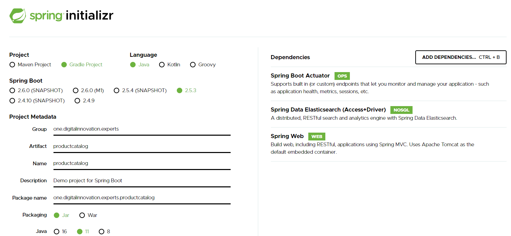

O professor:

1- Criou um projeto vazio no IntelliJ (File > New > Empty Project) e copiou a pasta descompactada com os arquivos gerados no site do [Spring Initializr](https://start.spring.io/) para dentro da pasta do projeto.

2 - Depois no Intellij ele importou esse diretorio para o projeto usando:

File > New > Module From Existing Sources.

## Parte 03: Conceito de Health Check e Configuração do Spring Data Elasticsearch

Para fazer o primeiro build do projeto o professor usou a aba gradle a direita da tela:

productcatalog > Tasks > Application > bootRun (clique duplo)

:point_right: _Actuator Helth_

Com a aplicação rodando, acessar o terminal para verificar o actuator helth.

No terminal do gitbash digitar: 

```
http://localhost:8080/actuator/health
```

*Essa parte eu não entendi. Não consegui enxergar o que estava na tela. Pesquisar sobre o Actuator Helth e como utilizar o terminal.

:point_right: _ElasticSearchConfig.java_:

A configuração passada em aula foi a seguinte:

```
@Configuration
@EnableElasticsearchRepositories(basePackages = "one.digitalinnovation.experts.productcatalog.repository")
public class ElasticSearchConfig extends AbstractElasticsearchConfiguration {

    @Override
    public RestHighLevelClient elasticsearchClient(){
        ClientConfiguration clientConfiguration = ClientConfiguration.builder()
                .connectedTo("localhost:9200", "localhost:9380")
                .build();
        return RestClients.create(clientConfiguration).rest();
    }

    @Bean
    @Override
    public EntityMpapper entityMapper(){
        ElasticSearchEntityMapper entityMapper = new ElasticSearchEntityMapper(elasticsearchMappingContext()),
                new DefaultConversionService();
        entityMapper.setConversions(elasticsearchCustomConversions());
        return entityMapper;
    }

}
```

=======================================

:rotating_light: Problema: O IntelliJ não encontra o import EntityMapper.

Segundo a minha pesquisa o EntityMapper foi [descontinuado](https://bit.ly/3C5pu6j). 

Opções:

1 - usar uma [versão mais antiga](https://bit.ly/3xmuQ9z).

2 - tentar usar o [recurso vigente](https://bit.ly/3lgH812).

======================================

Seguindo a opção 2: Utilizar a versão mais recente da High Level REST Client.

O professor usou Docker Compose para rodar:

* [Elasticsearch](https://docs.spring.io/spring-data/elasticsearch/docs/current/reference/html/#reference)
* Redis

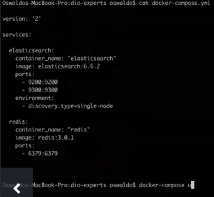

Em microsserviços a intenção é usar dependências apenas quando absolutamente necessárias, mas sempre tentando minimizar ao máximo seu impacto em caso de falha. Os microsserviços não devem depender de outros serviços ou dependências para que o risco de falharem seja menor.

O Spring Boot, através do Actuator, consegue rastrear as dependências do microsserviço e mostrar se ele está ou não saudável. 

Para minimizar esse tipo de dependência é usual não criar um único ponto de falha(Single Point of Failure - SPOF). Se o Elasticsearch é essencial, pode-se criar um cluster. Ex: criar o Elasticsearch de uma forma que ele tenha pelo menos 3 servidores na master e dois servidores de dados. Criar uma estrutura robusta para minimizar as falhas.

Para desenvolvimento ele usou um single node, mas não faria isso de maneira alguma em produção.

## Parte 4: Modelagem e persistência de dados com Spring Data Elasticsearch em uma API REST

**Pacote model > classe Product**

Anotação importante:
@Document ->  aplicada a nível de classe para indicar que essa classe é candidata ao mapeamento para banco de dados. Atributos importantes:
* indexName -> Nome do índice no qual armazenar a entidade (tabela).
* type -> mostrada em aula, mas depreciada desde a versão 4.0
* createIndex -> Sinalize se desaja criar um index na inicialização do repositório. O valor padrão é verdadeiro.

Sugestão para refatoração desta classe: usar o Lombok para não precisar deixar os getters e setters explicitos.

```
@Document(indexName = "product")
```

**Pacote Repository > Interface ProductRepository**

```
public interface ProductRepository extends CrudRepository<Product, Integer> {

}

```

**Pacote controller > ProductController**

```
RestController
@RequestMapping(value = "/product")
public class ProductController {

    @Autowired
    private ProductRepository productRepository;

    @RequestMapping(method = RequestMethod.POST)
    Product create(@RequestBody Product product){
        return productRepository.save(product);

    }
}
```

## Parte 5: Configurando um microsserviço de carrinho de compras com Spring Data Redis

Para o Product Catalog o Elasticsearch faz total sentido e funciona muito bem, mas não necessariamente precisa ser aplicado a todos os microsserviços do projeto. Imagine o Shopping Cart (carrinho de compras). Ele poderia usar o Redis, por exemplo. O carinho de compras trabalha com informações mais voláteis.

Ele copiou o diretório com o serviço do carrinho de compras para dentro do diretório do projeto e importou da mesma forma que o primeiro (File > New > Module from existing sources)

**Diretórios do shopping cart**:

* config
* controller
* model
* repository
* shoppingcart (onde fica a classe ShoppingCartApplication)

**config > RedisConfig**:

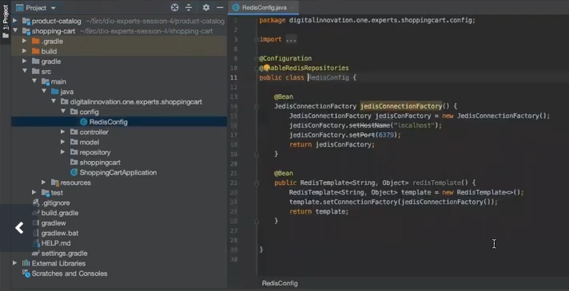

**model > Cart**:

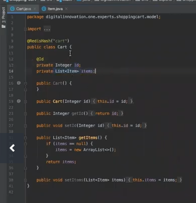

**model > Item**:

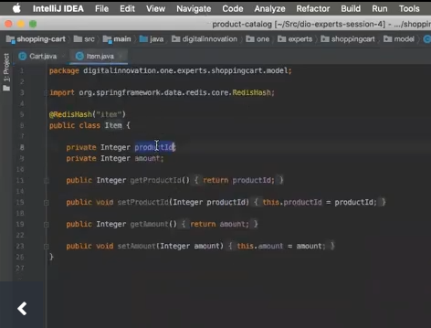

**repository > CartRepository**:

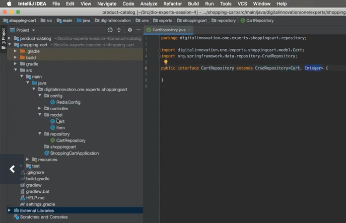


**controller > CartController**

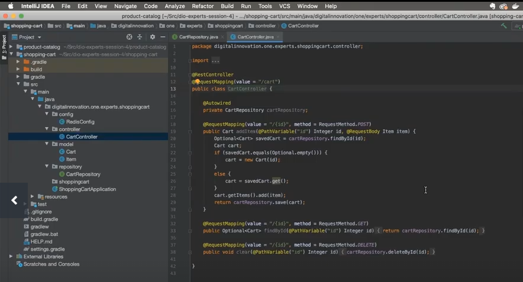


Ao tentar startar a aplicação através do bootrun, houve um erro:

> Web server failed to start. Port 8080 was already in use.

Dentro da pasta Java há uma pasta chamada Resources e dentro dela um arquivo chamado application.yml

Nesse arquivo são guardadas algumas configurações referentes aos microsserviços. Configurando a porta na qual vai ser executada a aplicação:

```
server:
  port:8082
```

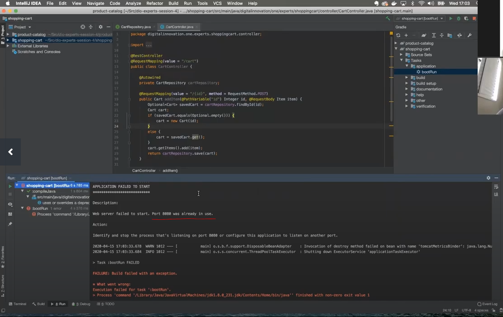

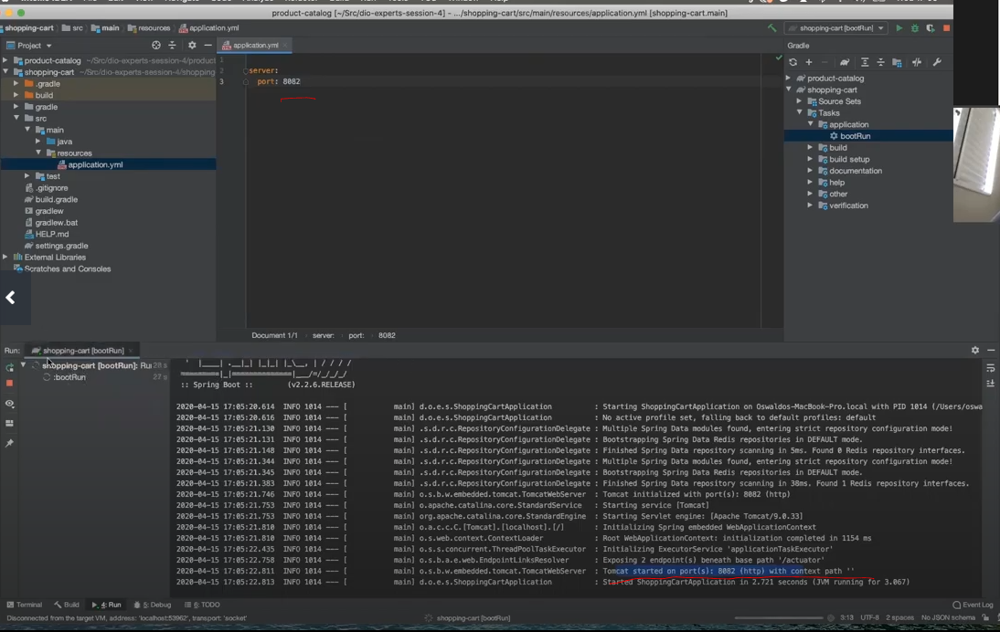

A estrutura de arquivos gerada pelo Spring Initializr na pasta resources ele costuma deletar e criar o arquivo application.yml para guardar as configurações.

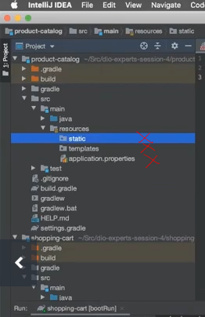


:construction: Em andamento...


## Parte 6: Criando um Config Server

Verificar se o shopping cart está funcionando usando o Helth Check:

```
http://localhost:8082/actuator/health

```

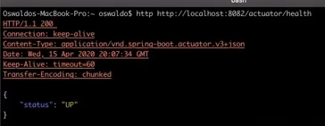


```
http POST http://localhost:8082/cart/123 productId=1 amount=1
```

```
http DELETE http://localhost:8082/cart/123 productId=1 amount=1
```

No Redis é possível ver os dados persistidos:

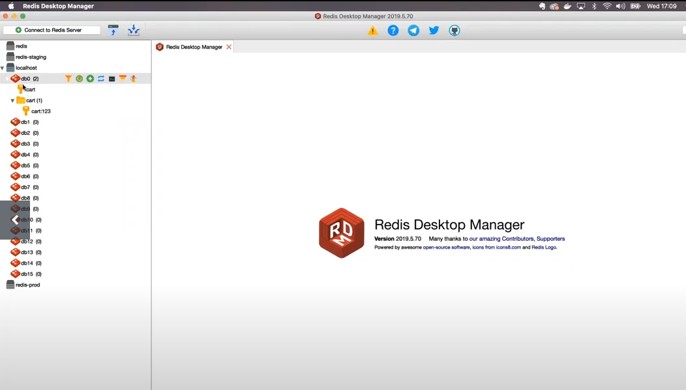


Quando a aplicação começa a crescer o gerenciamentos dos microsserviços começa a ficar mais complicado porque existem muitas configurações para conectar os serviços. Para isso é bom ter um
congig.server.

**Criar o config server**:

Acesse o site do [https://start.spring.io/](https://start.spring.io/), monte a configuração a seguir e baixe o pacote:

Project: Gradle

Language: Java

Spring Boot: versão mais recente estável

Packing: jar

Java: LTS mais recente

Dependências:

* Spring Boot Actuator
* Spring Web
* Config Server


Copiar a pasta descompactada e colar dentro da pasta do projeto.

File > New > Module from existing sources

É preciso habilitar o config server na classe principal do pacote importado:

**ConfigServerApplication.java**

```
@SpringBootApplication
@EnableConfigServer
public class ConfigServerApplication{
    public static void main(String[] args){
        SpringApplication.run{
            ConfigServerApplication.class, args);
        }
    }
}
```

**resources > application.yml**

Criar o arquivo application.yml na pasta resources.

```
server:
    port:8888
```

Diz a aplicação onde ela poderá encontrar as configurações:

```
spring:
    cloud:
        config:
            server?
                git:
                    uri: https://github.com/brgillian/dionomedorepositorio.git
```


## Parte 7: Conectando os microsserviços ao Config Server

Verificar se o seviço está saudável:

```
http://localhost:8082/actuator/health

```

```
http http://localhost:8888/product-catalog/default
```

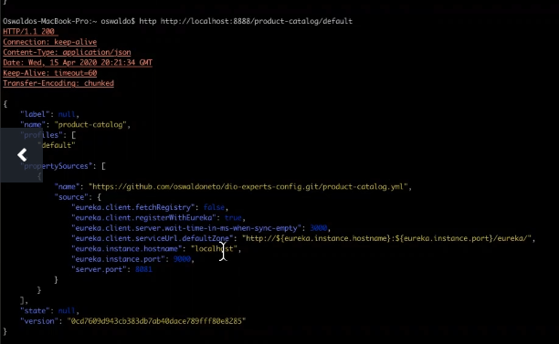


Abrir o resources > application.yml do product-catalog e apagar a informação sobre a porta. Essa informação deve vir do config.server. A configuração a seguir deve ficar no application.yml

```
spring:
   application:
      name:product-catalog     
   cloud:
      config:
        uri: http://localhost:8888
```

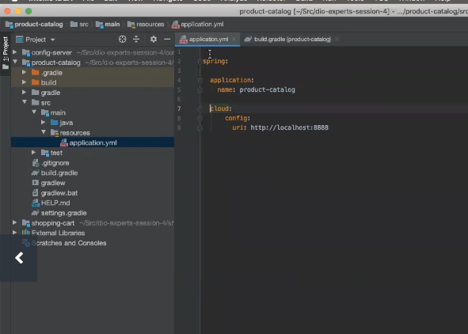


Suba a aplicação e verifique o log.


Abrir o resources > application.yml do shopping-cart e apagar a informação sobre a porta.


```
spring:
   application:
      name:shopping-cart
   cloud:
      config:
        uri: http://localhost:8888
```

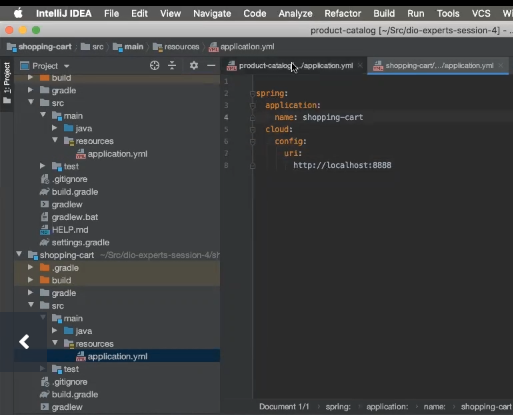


Abrir o build.gradle tanto do shopping-cart quanto do product-catalog e adicionar as dependências:

```
ext{
    set('springCloudVersion',"Hoxton.SR3")
}

implementation 'org.springframework.cloud:spring-starter-config'

dependencyManagement{
    imports{
        MavenBon "org.springframework.cloud:spring-cloud-dependencies:${springCloudVersion}"
    }
}
```

## Parte 8: Criando um Service Discovery

Numa arquitetura de microsserviços é importante centralizar as configurações dos serviços no config server. Se o servidor de configuração vai puxar as informações de uma máquina local, do git ou de qualquer outro local, não importa.

Em produção nunca colocar as configurações no Git de maneira pública por poder conter dados sensíveis. O exemplo desta aula tem a finalidade de ilustrar o funcionamento a comunicação com o config server.

Numa aplicação de prod como o config server é muito importante para todos os microsserviços, ele deve ficar dentro de um cluster para evitar o POF. 

**Service Discovery**

Usar URLs hard-coded não é uma boa prática quando se fala em microsserviços. Ex: o shopping-cart não pode ter uma url direta do produtct-catalog, por exemplo. Como resolver isso? Utilizando o Service Discovery.

Todo serviço que se iniciar vai se registrar no Service Discovery.

Isso gera o problema de overhead. Nunca mais haverá uma chamada direta para o serviço que se quer chamar. Sempre haverá mais um passo (o contato com o Service Discovery). Isso é um ponto negativo.

O Spring Cloud tenta resolver isso fazendo com que os microsserviços mantenham um cache para evitar consultas constantes.

O Service Discovery também tem uma função importantíssima de atuar como Low Balance.

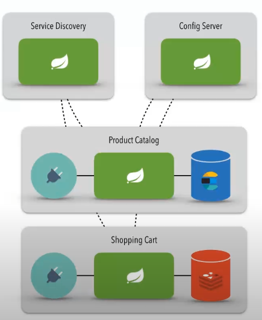

Voltamos ao [Spring Boot Initialzr](https://start.spring.io/) para criar a estrutura básica do Service Discovery.

Adicionar como dependências: 
* Eureka Server
* Config Client

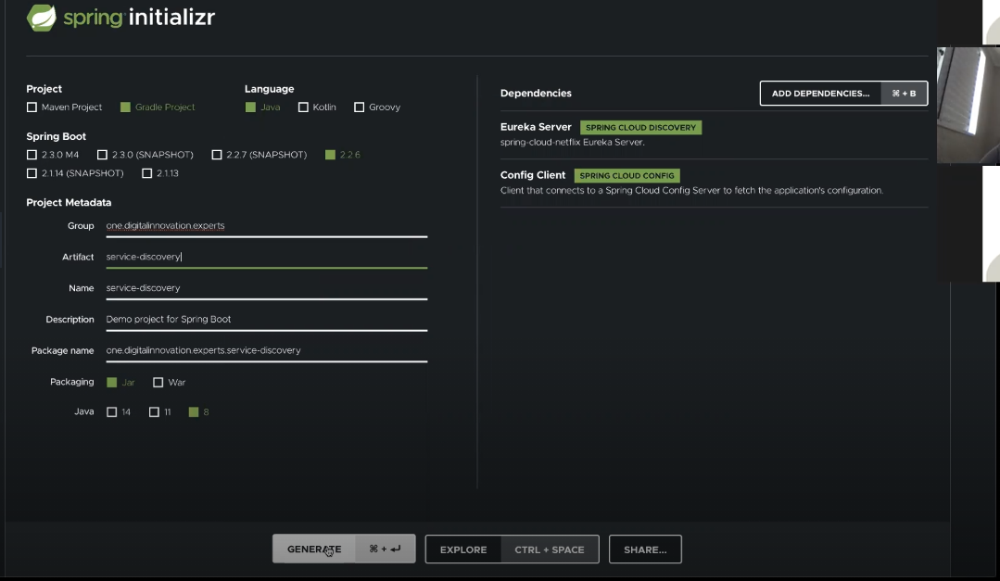

Importar o pacote gerado no Spring Boot Initialz para dentro da pasta do projeto e File > New > Module From Existing Sources.

Abra a classe principal do Service Discovery (ServiceDiscoveryApplication) e coloque a anotação abaixo da anotação @SpringBootApplication:

```
@EnableEurekaServer
```

No build.gradle do Service Discovery importar:


```
implementation 'org.springframework.cloud:spring-starter-netflix-eureka-server'
```


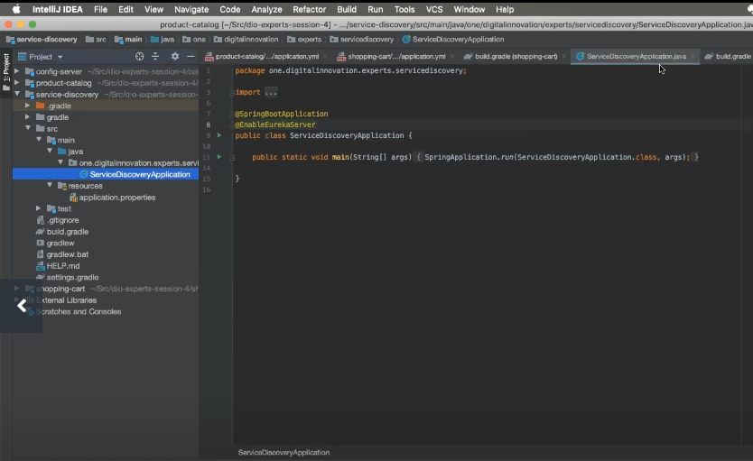


**Resourses > Application.yml**

```
spring:
   application
      name:service-discovery
   cloud:
      config:
         uri: http://localhost:8888
```

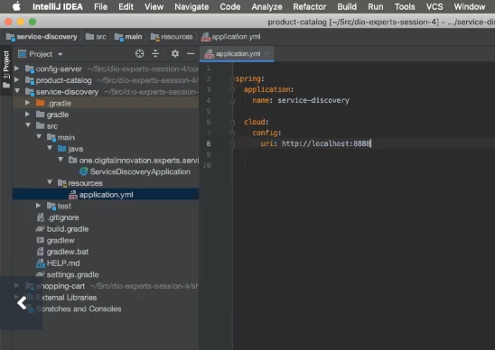

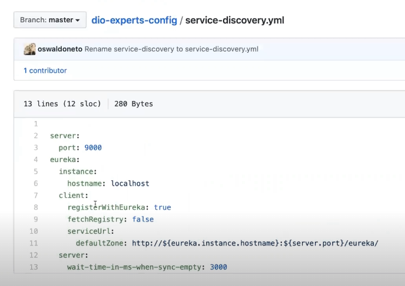


## Parte 9:Registrando os microsserviços ao service discovery e criando um gateway

O Eureka tem uma interface gráfica.

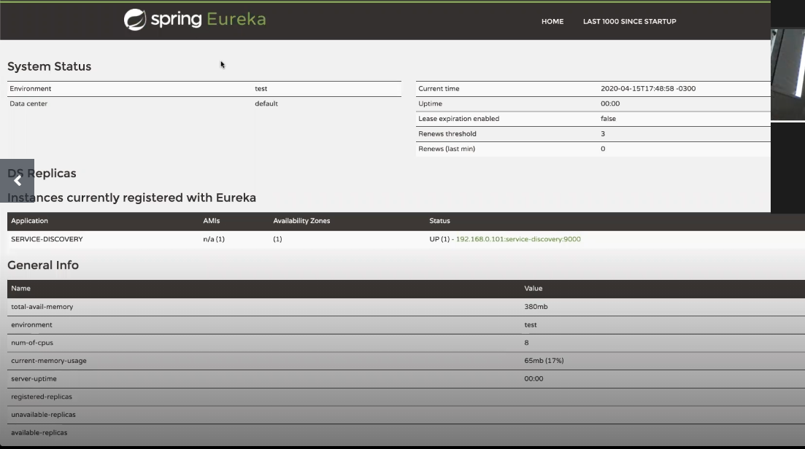


O Service Discovery é client do próprio Service Discovery e é por isso que ele aparece na tela registrado.

Agora é preciso fazer com que as outras aplicações também se registrem no Service Discovery.

**Product-Catalog**

Subimos o Eurika Server agora é preciso incluir a dependência do Eurika Client.

```
implementation 'org.springframework.cloud:spring-starter-netflix-eureka-client'
```

Iniciar a aplicação para testar se está se registrando.


Adicionar essa mesma dependência aos outros serviços (shopping-cart, product-catalog)

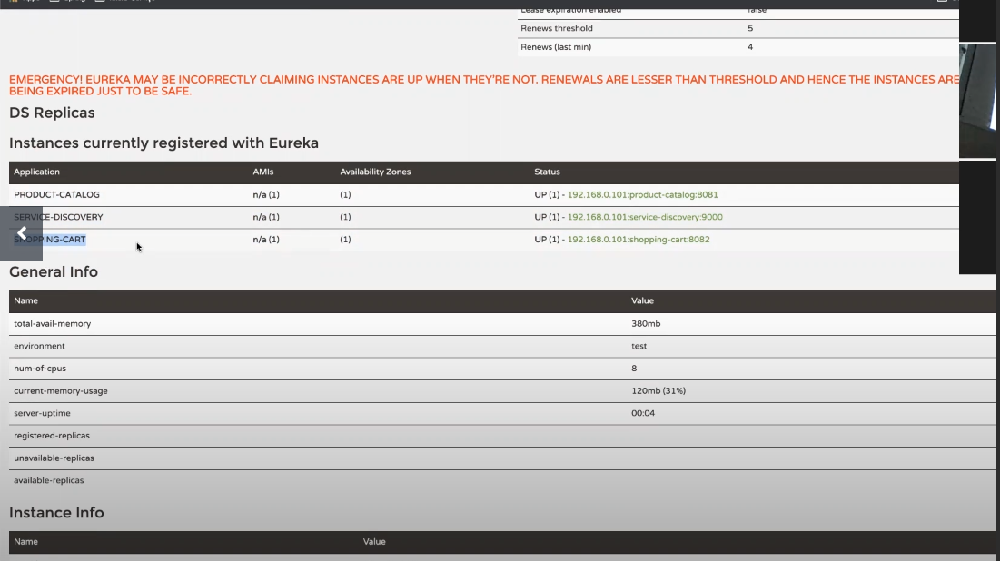

Quando o front-end precisa consumir os microsserviços,ele nunca deve entrar em contato direto com eles.

O front-end fala com o gateway e o gateway se comunica com os microsserviços.

Não é comum ter autenticação dentro do microsserviço.

**Montando um gateway**

No Spring Initialzr gerar um pacote com as dependências:

* Spring Boot Actuator
* Gateway

Copiar o pacote descompactado para a pasta do projeto e acessar File > New > Module From Existing Sources.

**resources > application.yml**

```
spring:
   application
      name:gateway
   cloud:
      config:
         uri: http://localhost:8888
```

Colocar a dependência do Eurika Client no arquivo build.gradle:

```
implementation 'org.springframework.cloud:spring-starter-netflix-eureka-client'
```

fetchRegistry:true -> 


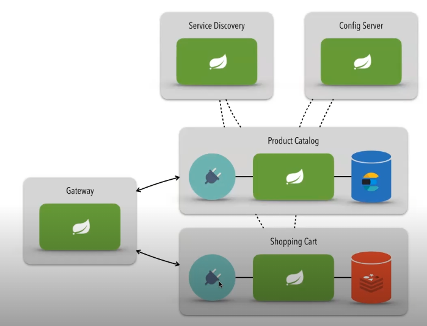

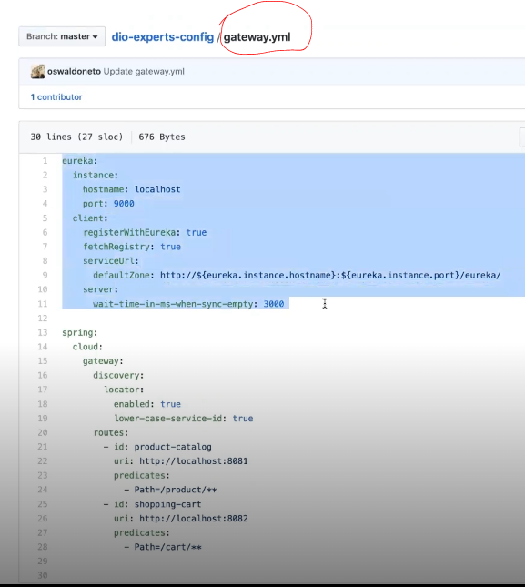

Corrigindo as Urls

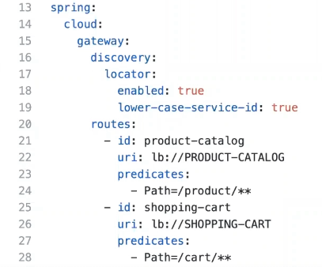

lb = load balance
